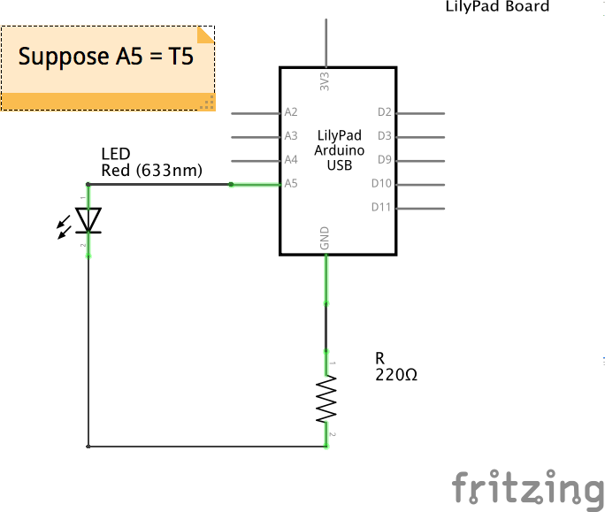

# Pythia

Named after the Oracles of Delphi, Pythia is a testbed with the objetive of testing human recognition along with natural language processing. It detects someone's presence, intriguing about his/her troubles and providing an aphorism as a solution.

## Hardware

* [LilyPad MP3 Player](https://www.sparkfun.com/products/11013)
* [Raspberry Pi](https://www.raspberrypi.org/products/raspberry-pi-3-model-b/)
* [Arduino UNO](https://store.arduino.cc/usa/arduino-uno-rev3)
* [Ultrasonic Sensor - HC-SR04](https://www.sparkfun.com/products/13959)
* [KY-038 Microphone sound sensor module](http://sensorkit.en.joy-it.net/index.php?title=KY-038_Microphone_sound_sensor_module)

## Getting to know the LilyPad MP3 Player

We'll go through a number of sketches in order to familiarize ourselves with the concepts behind the LilyPad MP3 Player and the Arduino language, thinking through the most important parts and incrementally enhancing each sketch.

It is strongly recommended to go through the official [LilyPad MP3 Player Getting Started](https://learn.sparkfun.com/tutorials/getting-started-with-the-lilypad-mp3-player) first.

### Prerequisites

* [Arduino IDE installed](https://www.arduino.cc/en/Main/Software)
* [The provided libraries inside LilyPad/libraries directory installed](https://www.arduino.cc/en/Guide/Libraries)
* Understand C/C++/Arduino

### IDE Configuration

* **Board:** Arduino Pro or Pro Mini *(Tools > Board)*
* **Processor:** ATmega328 (3.3V, 8MHz) *(Tools > Processor)*
* **Port:** select the port that your FTDI board or cable is using. This is usually the highest number; you can be sure if you unplug the FTDI and the number disappears *(Tools > Port)*

### Basic Arduino Concepts

Let's review first some basic Arduino concepts which are recurrent to every sketch.

#### loop() and setup()

Every Arduino sketch is composed by the `setup()` and `loop()` functions. The `setup()` function is called only once when the sketch starts. As the name suggests, it is where the setup happens: initialization of variables, set pin modes, library classes, search and store files, etc.

On the other hand, the `loop()` function loops consecutively, allowing your program to read inputs, change it's state and respond. Here you can read pins (triggers in our case) status and respond accordingly, for instance, by playing or stopping a song.

#### Pins

The pins are the primary source of I/O communication for our board. In the case of the LilyPad MP3 Player we will be talking about **Triggers** which go from T1 to T5. Pins can have two possible values: `HIGH` and `LOW` and indicate the volts the pins are at. In the case of the LilyPad MP3 Player, `LOW` means 0V and `HIGH` means 3.3V.

These values may be read with `digitalRead()` function and set with the `digitalWrite()` function. We could, for example, set a trigger to an initial value of `HIGH` with `digitalWrite()` and check with `digitalRead()` if the value has changed to `LOW` and act accordingly.

#### Serial

[Serial](https://www.arduino.cc/en/Reference/Serial) is used for communication between the Arduino board and a computer or other devices. It is used to transmit and read bytes through USB. It communicates on the RX and TX pins, where RX is where information is *received* and TX where it is *transmitted*.

The Serial may be used for debugging purposes as well as transferring information picked up by sensors to another device which would consume such information in another more sophisticated manner. It's primary methods are `Serial.println()`, `Serial.print()` and `Serial.read()`. It must be initialized with `Serial.begin()` which receives the datarate in bits per seconds (baud). Usually 9600 bauds.

### Trigger Sketch

This sketch comes preinstalled with the LilyPad MP3 Player. It will wait for one of the five trigger inputs to be grounded and will then play the corresponding audio file from the micro-SD card. The audio files should be placed under the root directory and renamed so the first character of each filename is the number "1" to "5", corresponding to the trigger that you want to play that file.
[Here](https://learn.sparkfun.com/tutorials/getting-started-with-the-lilypad-mp3-player/supported-audio-formats) are the supported audio formats.

The Sparkfun original source code is provided under the [TriggerDebug.ino](LilyPad/TriggerDebug/TriggerDebug.ino) file and a version without the debug directives, in order to improve code readability, is provided under the [Trigger.ino](LilyPad/Trigger/Trigger.ino) file. While the code is reasonably easy to understand on it's own, let's go through the essential parts which conform the basics of our LilyPad sketches. The [Trigger.ino](LilyPad/Trigger/Trigger.ino) sketch will be analyzed.

#### Code Explanation

#### setup()

Since we are planning to *receive* information from each of the triggers they are set to `INPUT` mode. Additionally, since the trigger inputs will be grounded, meaning they will enter a `LOW` mode, we manually set them to `HIGH` mode in order to be able to detect *when* they are grounded. In other words, we can detect a change from `HIGH` to `LOW` state.

```C++
for (x = 0; x <= 4; x++) {
    pinMode(trigger[x],INPUT);
    digitalWrite(trigger[x],HIGH);
}
```

Startup of the `SdFat` which allows us to traverse and read from the micro-SD. It's a utility class provided by the **SdFat** library. The `SD_CS` constant corresponds to the chip select for the SD card and `SPI_HALF_SPEED` to it's clock speed.

```C++
sd.begin(SD_CS, SPI_HALF_SPEED);
```

Startup of the `SFEMP3Shield` which allows us to play songs and any other kind of audio. It's a utility class provided by the `SFEMP3Shield` library.

```C++
MP3player.begin();
```

Change the micro-SD volume working directory to "/" as well as the current working directory. This is provided by the `true` value passed as parameter. This allows us to easily traverse the contents of any given directory.

```C++
sd.chdir("/",true);
```

Iterate through the files and subdirectories of the volume working directory, previously set to "/". Note `sd.vwd()` corresponds to a `SdFat` instance representing the directory contaning the file to be opened. `O_READ` corresponds to the usual flags associated with file operations. If the file name corresponds to the defined format it is saved in an array. The filename is read as a 13 length string. Note that if multiple filenames correspond to the same number, the last one read will be the one stored into the buffer. Finally, the file is closed. Attempting to open an already open file results in an error.

```C++
while (file.openNext(sd.vwd(),O_READ)) {
    file.getFilename(tempfilename);

    if (tempfilename[0] >= '1' && tempfilename[0] <= '5') {
        index = tempfilename[0] - '1';
        strcpy(filename[index],tempfilename);  
    }

    file.close();
}
```

#### loop()

Every trigger is read looking for a `LOW` status meaning it has been grounded (triggered). Here we can see why they were all set to `HIGH` in the first place.

A while loop representing a 50 msec delay to avoid a switch bounce. Note that it tics when the previously grounded trigger is in a `HIGH` state, therefore it will keep looping until we stop grounding the trigger.

Finally, if the interrupt or interrupt flags are set, the `MP3player` is stopped and played with the filename corresponding to the grounded trigger. We only need the name of the music file in order to play it.

```C++
for(t = 1; t <= 5; t++) {
    if (digitalRead(trigger[t-1]) == LOW) {
        x = 0;
        while(x < 50) {
            if (digitalRead(trigger[t-1]) == HIGH)
                x++;
            else
                x = 0;
            delay(1);
        } 

        if (filename[t-1][0] != 0) {
            if (interrupt && MP3player.isPlaying() && ((t != last_t) || interruptself)) {
                MP3player.stopTrack();
            }

            result = MP3player.playMP3(filename[t-1]);

            if (result == 0) 
                last_t = t;  // Save playing trigger
        }
    }
}
``` 

### Player Sketch

Let's build an MP3 player with the following features: PLAY, STOP, RESTART (restarts current song), NEXT and PREV. They will be assigned to the following triggers:

* T1: RESTART
* T2: NEXT
* T3: PLAY and STOP
* T4: PREV

We'll build simple versions, incrementally adding the necessary features until the final version.

### Version 1.0

Initially, let's play every audio file inside the root directory, one after the other and looping to the beginning once all audio files have been played. We'll have to:

* Determine when an audio file has finished playing
* Read the next audio file
* Loop all over again when all audio files in the directory have been read
* Validate that the file read is actually an audio file
* Play the audio file

The source code may be found under [Player1.0.ino](LilyPad/Player/Player1.0/Player1.0.ino). I encourage you to read it on your own before reading the explanation, it's very easy to follow.

#### Code Explanation

Since there should always be music playing, the simplest way to determine if an audio file has finished playing is merely checking if the `MP3Player` is playing. If it is not playing, we delay 50 msec and play the next track.

```C++
if (!MP3player.isPlaying()) {
    delay(50);
    playNextTrack();
}
```

In order to play the next track we first read the next filename in the root directory and store it into the `filename` `char` array. We must keep reading until we receive a valid audio file. Afterwards, we just play the file with the `MP3player.playMP3()` method.

```C++
void playNextTrack() {
  char filename[13];

  getNextFilename(filename);

  while (!isValidAudioFile(filename)) {
    getNextFilename(filename); 
  }

  MP3player.playMP3(filename);
}
```

Finally, in order to read the next filename, we make use of `file.openNext()`, which iterates over the files given by `sd.vwd()`. If no files are left to be read, `file.openNext()` returns 0, so we reset the file iterator by setting the SD VWD to root again .

```C++
void getNextFilename(char filename[]) {
  SdFile file;

  if (file.openNext(sd.vwd(), O_READ)) {
    file.getFilename(filename);
    file.close();
  }
  else {
    sd.chdir("/", true);  // Reset iterator
    getNextFilename(filename);
  }
}
```
### Version 2.0

Let's add now the PLAY and STOP funcitonality. Recall we will assign both to T3. We'll have to:

* Assign T3 as an `INPUT` pin (it will *receive* information) and set it to a `HIGH` state
* Determine when T3 enters a `LOW` state and take an action
* STOP the audio if it was *playing*; PLAY it otherwise

The source code may be found under [Player2.0.ino](LilyPad/Player/Player2.0/Player2.0.ino). As before, it is recommended to read it on your own before delving into the explanation.

#### Code Explanation

First, inside the `setup()` function, we prepare the T3 trigger. Since we will be *receiving* information from the pin it must be set to `INPUT`. Additionally, we set it to a `HIGH` state in order to check for a `LOW` state when it is grounded. Note that we previously defined `const int T3 = A5` as a global constant.

```C++
  pinMode(T3, INPUT);
  digitalWrite(T3, HIGH);
```

To be able to determine whether an audio file is playing or not, we make use of a `playing` flag. We cannot just check the value of `MP3player.isPlaying()` for this purpose because we are already relying on it for automatically playing the next song on the list. Therefore, we change the following line:

```C++
if (!MP3player.isPlaying()) {
    delay(50);
    playNextTrack();
}
```

to:

```C++
if (playing && !MP3player.isPlaying()) {
    delay(50);
    playNextTrack();
}
```

This way we prevent playing the next track if the player has been stopped, meaning `playing == false`.
Finally, we take an action if T3 is in a `LOW` state: STOP the track if it was `playing` or PLAY it otherwise.

```C++
if (digitalRead(T3) == LOW) {
  waitTriggerHigh(T3);
  
  if (playing)
    stopTrack();
  else
    resumeTrack();
}

void stopTrack() {
  playing = false;
  MP3player.pauseMusic();
}

void resumeTrack() {
  playing = true;
  MP3player.resumeMusic();
}
```

The last consideration is that the following line was added to `playNextTrack()`:

```C++
playing = true;
```

### Final Version

For the final version, we have to implement the RESTART, NEXT and PREV functionality. For this we will have to:

* Initialize the corresponding pins to `INPUT` and `HIGH` status
* Replay the current audio file when RESTART trigger is grounded
* Stop playing the current audio file when the PREV or NEXT trigger are grounded
* Determine the previous audio file played when PREV is grounded and play it
* Determine the next audio file when NEXT is grounded and play it

The source code may be found under [Player.ino](LilyPad/Player/Player/Player.ino). This code is a bit more complex than the others but still manageable.

#### Code Explanation

First of all, with the objective in mind of avoiding an `if` "trigger grounded then do this and that" chain for each trigger, we define a `Trigger` struct with the corresponding pin number and a function pointer to the action to be taken when such trigger is grounded. This allows us to define an array with each `Trigger` and simplify the `loop()` function by just iterating and checking if each pin has been grounded and execute an action if that's the case.

```C++
typedef struct {
    int trigger;
    void (*executor) (void);
} Trigger;

const Trigger triggers[] = {
                            {T1, &restartTrack}, 
                            {T2, &playNextTrack},
                            {T3, &toggleTrack}, 
                            {T4, &playPrevTrack}
                            };
```

and inside `loop()`:

```C++
int i;
for (i = 0; i < TRIGGERS_SIZE; i++) {
  if (digitalRead(triggers[i].trigger) == LOW) {
    waitTriggerHigh(triggers[i].trigger);
    triggers[i].executor();
  }
}  
```

The RESTART function makes use of `MP3player.skipTo()` which receives a msec skipping to that msec in the audio file. Beware that it automatically starts playing the audio file, so we check the value of the `playing` flag to determine if we should stop or not the music.

```C++
void restartTrack() {
  MP3player.skipTo(0);
  
  if (!playing)
    MP3player.pauseMusic();
}
```

The NEXT function makes use of `playNextTrack()` which is the as in version 1.0. The only precaution to be taken of is that the micro-SD files cannot be iterated while the MP3player is playing, so it is necessary to stop it before reading the next filename. Similarly, the MP3player must be stopped before playing a new audio file.

The PLAY and STOP functions were wrapped inside a `toggleTrack()` function which simply calls `stopTrack()` and `resumeTrack()` from version 2.0.

```C++
void toggleTrack() {
  if (playing)
    stopTrack();
  else
    resumeTrack();
}
```

Finally, the PREV function iterates the micro-SD backwards until a valid audio file is found. Iterating backwards it's not as simple as iterating forward. We must read files, storing the last one read until find the current file being played. This way, the stored filename represents the previous audio file to the current one. After that we iterate once more until the previous filename is read in order to reset the iterator: the next call to `getNextFilename()` should return the current track.

```C++
void playPrevTrack() {
  char prevFilename[MAX_FILENAME];
  
  getPrevFilename(prevFilename, currentTrack);
  strcpy(currentTrack, prevFilename);

  while (!isValidAudioFile(currentTrack)) {
    getPrevFilename(prevFilename, currentTrack);
    strcpy(currentTrack, prevFilename);
  }

  playTrack(currentTrack);
}

// Stores in prevFilename the previous file to currentFilename
void getPrevFilename(char prevFilename[], const char * currentFilename) {
  char loopFilename[MAX_FILENAME];

  strcpy(prevFilename, currentFilename);
  getNextFilename(loopFilename);

  while (strcasecmp(loopFilename, currentFilename) != 0) {
    strcpy(prevFilename, loopFilename);
    getNextFilename(loopFilename);
  }

  // Place iterator such that next call to getNextFilename returns currentFilename  
  while (strcasecmp(loopFilename, prevFilename) != 0)
    getNextFilename(loopFilename);
}
```

Notice that to be able to iterate backwards we need to know the name of the current track being played, so we define a `currentTrack` global and set it after every call to `playPrevTrack()` and `playNextTrack()`, as well as setting `playing = true`, stop the MP3player and wait until the MP3player is actually playing after a call to `MP3player.playMP3()`. To do this without repeating code between this two functions we define:

```C++
void playTrack(const char * trackName) {
  if (MP3player.isPlaying())
    MP3player.stopTrack();
  
  MP3player.playMP3(trackName);
  while (!MP3player.isPlaying()) // Wait until it starts playing
  ;
  playing = true;
  strcpy(currentTrack, trackName);
}
```

#### Final notes

* The filenames retrieved by the SD library are in the [8.3 format (short filename)](https://en.wikipedia.org/wiki/8.3_filename), which maximum length is of 12 plus the null character.
* Avoid using the T4 trigger when debugging. Since it is shared by the TX (transmitter) serial line, every write to the Serial will ground the T4 trigger. It is recommended to replace T4 for T5 in this case. While T5 is shared by the RX (receiver) serial line, information is never received from the Serial in this Sketch, so it shouldn't cause any trouble.

### Enhancing the Player Sketch with LED

A very simple but interesting addition to our already functional [Player Sketch](LilyPad/Player/Player/Player.ino) is to add a LED which is turned on as long as there is music playing. This means that grounding the STOP trigger (T2) would turn off or on the LED depending on if it was playing or not respectively. We need to:

* Set T5, the only trigger left, as `OUTPUT` mode since it will be *sending* information
* Write `HIGH` to T5 if music is playing, write `LOW` otherwise

Remember that `HIGH` means a value of 3.3V and `LOW` means 0V. This numbers are important in order to calculate the resistance needed for the LED. The source code may be found under [PlayerLED.ino](LilyPad/Player/PlayerLED/PlayerLED.ino) and it's pretty straightforward. The most important concepts to gather are the ones regarding building a [circuit](https://learn.sparkfun.com/tutorials/what-is-a-circuit), [Ohm's Law](https://learn.sparkfun.com/tutorials/voltage-current-resistance-and-ohms-law), [resistance calculation](https://learn.sparkfun.com/tutorials/resistors/example-applications) and the use of a [breadboard](https://learn.sparkfun.com/tutorials/how-to-use-a-breadboard).

#### Code Explanation

Inside `setup()` T5 is set to `OUTPUT` mode. It will *send* information and act as the *positive* side of the source of electricity.

```C++
pinMode(T5, OUTPUT);
```

Inside `loop()` we write `HIGH` or `LOW` to T5 depending on the value of the `playing` flag:

```C++
if (playing)
    digitalWrite(T5, HIGH);
else
    digitalWrite(T5, LOW);
```

#### Board Schematic

Inside the [PlayerLED directory](LilyPad/Player/PlayerLED) you may find a breadboard schematic which may be edited with the [Fritzing](http://fritzing.org/home/) open source software. Currently there is no part for the Lilypad MP3 Player so I used the Lilypad Arduino USB part and left notes where T5 and GND would be in the Lilypad MP3 Player.


This would represent the following circuit:



## Managing Sensors with Arduino UNO

Let's focus now towards the development of sensors in order for Pythia to verify if someone is effectively in front of her and therefore engage in a conversation. Keep in mind we have to check when:

* Someone is at certain distance near of Pythia
* Someone actually leaves the proximity of Pythia
* Someone is only passing by in front of Pythia but continues his/her way. Pythia gotta ignore those.

Once conversation has been engaged, it is necessary to determine when someone is talking to Pythia and has effectively finished to do so. This means that we have to check when:

* Someone is talking to Pythia
* Someone has finished talking to Pythia

### IDE Configuration

* **Board:** Arduino/Genuino UNO *(Tools > Board)*
* **Port:** select the port that your FTDI board or cable is using. This is usually the highest number; you can be sure if you unplug the FTDI and the number disappears *(Tools > Port)*

### A Sight to See

Let's develop some eyes for Pythia with the Ultrasonic Sensor HC-SR04 sensor. Operating with the HC-SR04 sensor is a simple task. Nonetheless, we will be using the [NewPing](http://playground.arduino.cc/Code/NewPing) library for working with it, abstracting us from the [necessary calculations and pulses](http://howtomechatronics.com/tutorials/arduino/ultrasonic-sensor-hc-sr04/) and providing already tested, robust solutions. Secondly, we'll take advantage of the [elapsedMillis](https://playground.arduino.cc/Code/ElapsedMillis) library for managing any kind of logic regarding some kind of time elapsed as we'll see shortly.

### Proximity Sketch

Let's light up some LEDs as proximity signals in order to accomplish the 3 conditions earlier described. We'll use RED, YELLOW and GREEN LEDs which will signal:

* **RED**: No one near
* **YELLOW**: Someone is near but might only be passing by
* **GREEN**: Someone has been near long enough (1.5 seconds) such that is definitely not only passing by

We'll be considering that 125 cm or lower means someone is near and that 1.5 seconds near is long enough. For this we will have to:

* Setup the LED pins as OUTPUT
* Setup the HC-SR04 sensor such that it only records 125 cm or lower distances
* Light RED if no distance is recorded. Keep in mind only distances below 100 cm get recorded
* Light YELLOW if a distance gets recorded
* Keep recording for 1.5 seconds
* Light RED if record lost before 1.5 seconds
* Light GREEN if record alive after 1.5 seconds

The source code may be found under [Proximity.ino](ArduinoUNO/Proximity/Proximity.ino). While most of it's logic relies on function pointers, the code is pretty easy to understand and therefore it is suggested to go through it on your own before delving into the explanation.

#### Code Explanation

The general idea is the implementation of a [state machine](http://codeandlife.com/2013/10/06/tutorial-state-machines-with-c-callbacks/) with the use of the `Proximity` struct which contains the corresponding LED to the proximity level and the callback (function pointer) to be executed in such state which also returns the new corresponding state (may be the same one). The callback receives the distance measured as argument.

```C++
typedef struct proximity {
  int led;
  struct proximity (*callback) (int);
} Proximity;
```

The corresponding proximity levels are the following:

```C++
const Proximity noOneNear = {
  RED,
  noOneNearCallback
};

const Proximity mayBeNear = {
  YELLOW,
  mayBeNearCallback
};

const Proximity isNear = {
  GREEN,
  isNearCallback
};
```

And the callbacks are pretty simple. They just transition from one state to another depending on the value of the distance recorded. In the case of the `noOneNear` to the `mayBeNear` transition the timer `someoneNearTime` from the *elapsedMillis* library is resetted.

```C++
Proximity noOneNearCallback(int distance) {
  if (distance) {
    someoneNearTime = 0;
    return mayBeNear;
  }
  else {
    return noOneNear;
  }
}

Proximity mayBeNearCallback(int distance) {
  if (distance && hasBeenNearEnough())
    return isNear;
  else if (distance)
    return mayBeNear;
  else
    return noOneNear;
}

Proximity isNearCallback(int distance) {
  if (distance)
    return isNear;
  else
    return noOneNear;
}

boolean hasBeenNearEnough() {
  return someoneNearTime > NEAR_ENOUGH_MILLIS;
}
```

Outcome of this modular scheme is that the main `loop` function is as simple as follows, avoiding cluttering code with heavy conditional IF logic or a switch/case scenario:

```C++
void loop() {
  int distance = sensor.ping_cm();
  int prevLed = proximity.led;
  proximity = proximity.callback(distance);

  if (prevLed != proximity.led) {
    digitalWrite(prevLed, LOW);
    digitalWrite(proximity.led, HIGH);
  }
  
  delay(100);
}
```

One last consideration regarding the use of the NewPing library. The sensor is initialized as follows:

```C++
NewPing sensor(TRIGGER, ECHO, MAX_DISTANCE);
```

where `TRIGGER` and `ECHO` correspond to the trigger and echo pins of the sensor respectively; and `MAX_DISTANCE` represents the maximum ping distance in centimeters the sensor would read. Any reading above such distance simply return 0. That's why we can work with `if (distance)` statements. 

#### Board Schematic


### Developing Hearing

Now that Pythia has got a pair of eyes she'll need some ears. For this we'll use the KY-038 Microphone sound sensor module digital output pin which returns `HIGH` if sound has been sensed and `LOW` otherwise. Our objective is that Pythia must be able to determine whether someone is talking to her or not. 

This is not an easy task. When we talk to someone we are not constantly emitting sound: we make pauses between words and phrases; we think about what to say next. The person listening to us *infers from the context* of what we are saying whether we have finished talking or not. Currently, Pythia does not have this capability; she may only determine if sound is being emitted or not. 

Therefore, we'll take the following criteria: if sound has been emitted, then someone is talking to Pythia. If no sound has been emitted for some time below a certain threshold then someone is still talking to Pythia. This threshold would represent our pauses natural in a conversation. Finally, if no sound has been emitted for some time above the threshold, then no one is talking to Pythia.

### TalkingSensor Library

Let's write our own library for this behaviour. All our `TalkingSensor` class will need to expose is a `isTalking()` method. A step by step guide for writing aa Arduino library may be found [here](https://www.arduino.cc/en/Hacking/LibraryTutorial). For implementing the library we'll have to:

* Write a header (.h) file where the `TalkingSensor` class is defined
* Implement it in a .cpp file
* Define a constructor which receives the pin from which the sound information may be recovered
* Read from the input pin if sound has been emitted when `isTalking()` is invoked
* Reset the sound counter if sound has been emitted
* Return `true` if counter is below threshold, `false` otherwise

The complete library may be found under [TalkingSensor](ArduinoUNO/libraries/TalkingSensor).

#### Library Code

We define the class with it's methods and private variables in the header file [TalkingSensor.h](ArduinoUNO/libraries/TalkingSensor/TalkingSensor.h):

```C++
/* 
 * TalkingSensor.h - Library for checking is someone is talking.
 * Released into the public domain
 */

#ifndef _talkingSensor_h_
#define _talkingSensor_h_

#include "Arduino.h"
#include <elapsedMillis.h>

#define DEFAULT_THRESHOLD 2000

class TalkingSensor {
  public:
    TalkingSensor(int digitalPin, int talkingThreshold = DEFAULT_THRESHOLD);
    bool isTalking();
  private:
    int _pin;
    int _talkingThreshold;
    elapsedMillis _timeSinceLastSound;
};

#endif
```

Note that we make use of the `elapsedMillis` library, therefore it is included in our header file. We implement it in [TalkingSensor.cpp](ArduinoUNO/libraries/TalkingSensor/TalkingSensor.cpp):

```C++
#include "TalkingSensor.h"

/* How many times the pin would be read for sound signals */
#define LISTEN_TRIES 20

TalkingSensor::TalkingSensor(int digitalPin, int talkingThreshold) {
  pinMode(digitalPin, INPUT);
  _pin = digitalPin;
  _talkingThreshold = talkingThreshold;
  _timeSinceLastSound = 0;
}

/*
 * Returns true if someone is talking, false otherwise.
 * The talking threshold time must be surprassed with
 * no sound in order to return false.
 */
bool TalkingSensor::isTalking() {
  int sound;

  for (int i = 0; i < LISTEN_TRIES; i++) {
      sound = digitalRead(_pin);
      if (sound == HIGH)
        _timeSinceLastSound = 0;
      delay(1);
  }

  return _timeSinceLastSound <= _talkingThreshold;
}

```

The code pretty much corresponds with the step-by-step earlier described. Note that we read the pin several times in order to extend the listen time window.

Finally, an example of use is presented under [TalkingSensorExample.ino](ArduinoUNO/libraries/TalkingSensor/examples/TalkingSensorExample/TalkingSensorExample.ino):

```C++
#include <TalkingSensor.h>

const int LED = 10 ;
const int DIGITAL_PIN = 13;

TalkingSensor talkingSensor(DIGITAL_PIN);  // Build sensor with default talkingThreshold

void setup() {
  Serial.begin(9600);
  pinMode(LED, OUTPUT);
}

void loop() {
  if (talkingSensor.isTalking()) {
    digitalWrite(LED, HIGH);
    Serial.println(F("someone is talking"));
  }
  else {
    digitalWrite(LED, LOW);
    Serial.println(F("silence"));
  }
}
```

### Sight and Hearing combined

We have developed sight and hearing senses for Pythia. It's time to bring those together! It's a relatively simple task. All we have to do is write to the `Serial` the most recent **change** of state; meaning when Pythia senses something **new**. The breakthrough about this is that we can now transmit pre-processed information about Pythia surroundings which can be picked up through the `Serial` by any other device, such as a computer.

The code may be found under [SightAndHearing.ino](ArduinoUNO/SightAndHearing/SightAndHearing.ino). As expected, is very similar to the last two codes we have seen.

### Code Explanation

Only the `setup()` and `loop()` functions are presented; the rest of the code is very similar to [Proximity.ino](ArduinoUNO/Proximity/Proximity.ino):

```C++
Proximity proximity;
bool isSomeoneTalking;

void setup() {
  int i;
  Serial.begin(9600);

  for (i = 0; i < nLeds; i++) {
    pinMode(leds[i], OUTPUT);
    digitalWrite(leds[i], LOW);
  }

  proximity = noOneNear;
  digitalWrite(proximity.led, HIGH);
  Serial.println(proximity.stateName);

  isSomeoneTalking = false;
  delay(TALK_THRESHOLD);
}

void loop() {
  int distance = sensor.convert_cm(sensor.ping_median(PINGS));
  int prevLed = proximity.led;
  bool prevTalking = isSomeoneTalking;
  
  proximity = proximity.callback(distance);
  isSomeoneTalking = talkingSensor.isTalking();

  if (prevLed != proximity.led) {
    Serial.println(proximity.stateName);
    digitalWrite(prevLed, LOW);
    digitalWrite(proximity.led, HIGH);
  }

  if (prevTalking != isSomeoneTalking && isSomeoneTalking)
    Serial.println("talking");
  else if (prevTalking != isSomeoneTalking && !isSomeoneTalking)
    Serial.println("silence");  
}
```

The most important thing to notice is the logic inside `loop()` for writing to the `Serial` a **change** of state. Therefore, a `bool isSomeoneTalking` variable is used to keep record of whether someone was already talking or not. More precisely, the following lines:

```C++
bool prevTalking = isSomeoneTalking;
...
isSomeoneTalking = talkingSensor.isTalking();
...
if (prevTalking != isSomeoneTalking && isSomeoneTalking)
  Serial.println("talking");
else if (prevTalking != isSomeoneTalking && !isSomeoneTalking)
  Serial.println("silence");  
```

Having developed sight and hearing, Pythia has everything she needs to consume the surroundings information in intelligent manners! Only a brain would suffice...

## Contact

Tomás Cerdá - <tcerda@itba.edu.ar>
